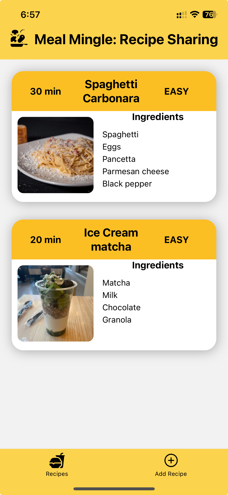
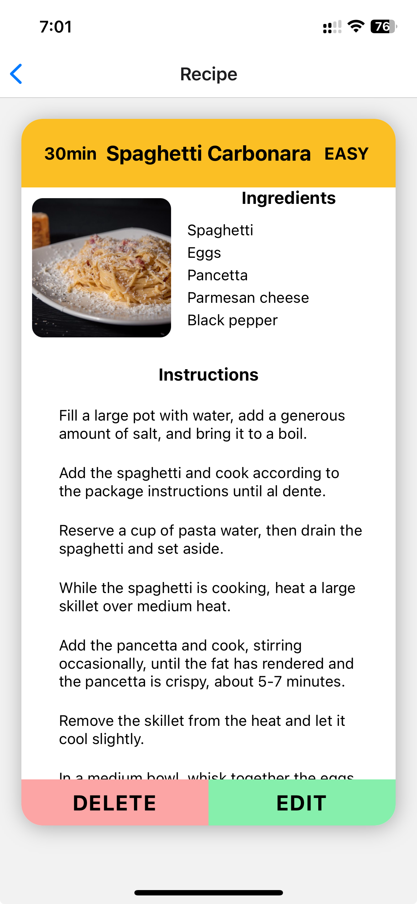
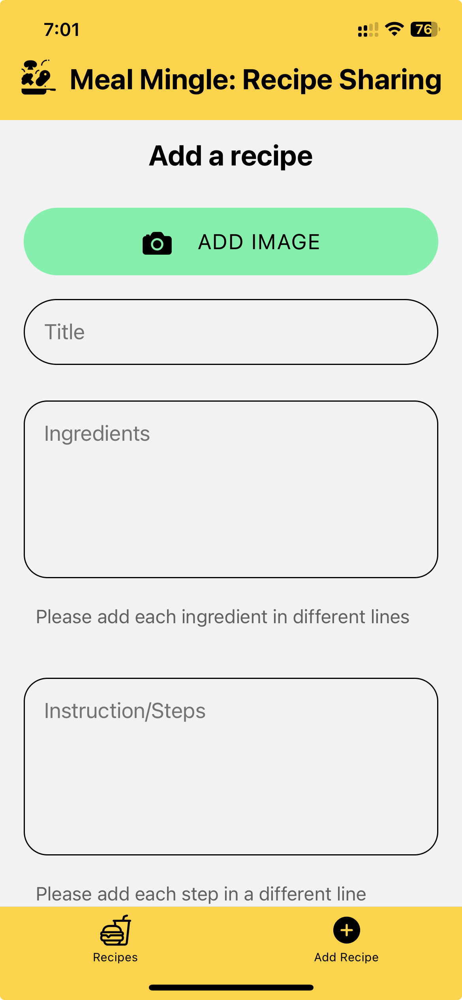

# Meal Mingle: Recipe Sharing App

Meal Mingle is a recipe sharing app built using React Native and Expo. The app allows users to share and explore recipes, including the ability to add, edit, and delete recipes. The application leverages AsyncStorage for local data persistence.

## Features

- View a list of all recipes
- View details of individual recipes
- Add new recipes
- Edit existing recipes
- Delete recipes
- Save recipes locally using AsyncStorage

## Screenshots





## Getting Started

These instructions will help you set up and run the project on your local machine.

### Prerequisites

- Node.js and npm installed
- Expo CLI installed
- Expo Go app installed on your mobile device

### Installation

1. Clone the repository:

   ```sh
   git clone https://github.com/your-username/meal-mingle.git
   cd meal-mingle
   ```

2. Install dependencies:

   ```sh
   npm install
   ```

3. Start the Expo development server:

   ```sh
   npx expo start
   ```

4. Open the project in Expo Go:

   - Scan the QR code generated by the Expo CLI with the Expo Go app on your mobile device.

## Usage

### Adding a Recipe

1. Click on the "Add Recipe" tab.
2. Fill in the recipe details including title, ingredients, instructions, difficulty level, and an optional image.
3. Click "Add Recipe" to save the recipe.

### Viewing Recipes

- Browse the list of available recipes on the "Recipes" tab.
- Click on a recipe to view its details.

### Editing a Recipe

1. View the recipe you want to edit.
2. Click on the "Edit" button.
3. Update the recipe details.
4. Click "Save" to update the recipe.

### Deleting a Recipe

1. View the recipe you want to delete.
2. Click on the "Delete" button.
3. Confirm the deletion.

## Acknowledgments

- [React Native](https://reactnative.dev/)
- [Expo](https://expo.dev/)
- [Firebase](https://firebase.google.com/)
- [AsyncStorage](https://github.com/react-native-async-storage/async-storage)
